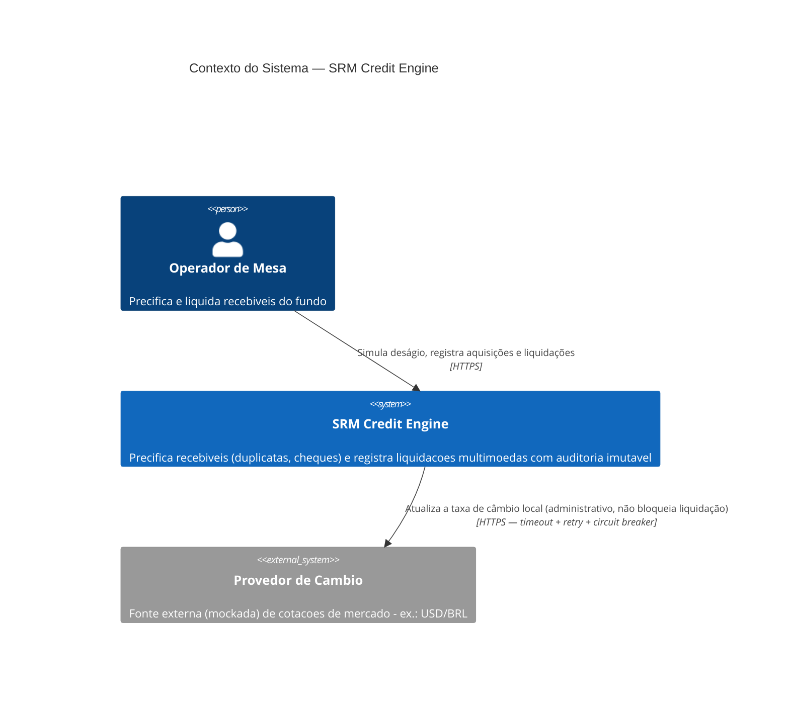
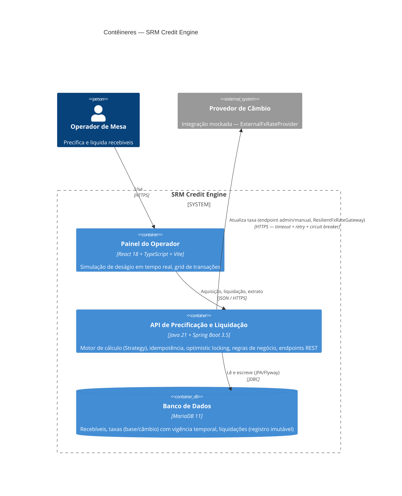

# Diagramas C4 — SRM Credit Engine

Níveis 1 (Contexto) e 2 (Contêineres), conforme item 6 do desafio (nível
sênior). Ambos em Mermaid — renderizam nativamente no GitHub, sem
ferramenta externa.

## Nível 1 — Contexto do Sistema

Quem usa o sistema e com quais sistemas externos ele conversa.

**Decisão de arquitetura que este nível já revela:** a seta entre o SRM
Credit Engine e o Provedor de Câmbio é rotulada "administrativo, não
bloqueia liquidação" de propósito — é a materialização visual da decisão do
SPEC 1.3 (câmbio travado na aquisição) e da seção de resiliência: nenhuma
operação financeira síncrona (aquisição ou liquidação) depende da
disponibilidade desse sistema externo em tempo real.

## Nível 2 — Contêineres

Como o SRM Credit Engine se decompõe internamente.

**Fronteiras de responsabilidade que valem destacar na defesa:**

- O **Painel do Operador** nunca fala diretamente com o Provedor de Câmbio
  nem com o banco — tudo passa pela API. O contêiner de API é o único ponto
  de acesso a dados e a integrações externas (nenhuma lógica de negócio ou
  acesso a dados no frontend).
- Dentro da API, `ReceivableService` (aquisição/liquidação) só fala com o
  Banco de Dados — nunca com o Provedor de Câmbio diretamente. Só
  `FxRateAdminService`/`ResilientFxRateGateway` (fluxo administrativo,
  fora do caminho crítico de uma transação financeira) fala com o
  provedor externo. Essa separação é o que torna a resposta a "o que
  acontece se o provedor de câmbio cair no meio de uma liquidação?"
  trivial: nada acontece, porque a liquidação nunca o chama.
