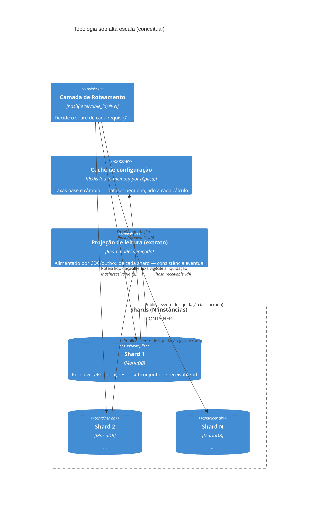

# Design de Alta Escala — 1.000.000 de transações/minuto

Documento do nível Staff/Tech Lead (seção 6 do desafio). Não é uma
proposta de reescrita — é uma análise de onde a arquitetura atual
(pensada para o volume de uma mesa de operações humana) quebraria sob
essa carga, e o que mudaria para sustentá-la.

## 1. Colocando o número em perspectiva

1.000.000 tx/min ≈ **16.667 liquidações por segundo**, sustentadas. Para
comparação: mesmo mesas de operação muito grandes processam dezenas ou
centenas de liquidações por minuto, não por segundo. Este volume não é
"uma mesa de operações maior" — é uma classe de problema diferente,
provavelmente originada de outro lugar no negócio (ex.: liquidação
automática de um fluxo de recebíveis gerado por um parceiro/marketplace
integrado via API, não por operadores humanos digitando).

Vale registrar isso porque muda a pergunta: não é "como deixamos o
`SettlementService` atual mais rápido", é "que partes da arquitetura
atual continuam válidas, e quais precisam ser substituídas".

## 2. Onde o gargalo aparece primeiro

A arquitetura atual (`docs/c4-diagrams.md`) tem exatamente **um** ponto
que não escala horizontalmente: a instância única de MariaDB. Cada
liquidação faz, na mesma transação, um `INSERT` em `settlements` e um
`UPDATE` em `receivables` com verificação de versão otimista. Um banco
relacional único, mesmo bem dimensionado, satura na casa de milhares de
transações de escrita por segundo — muito antes de 16.667/s.

O motor de precificação (`PricingEngine`) **não** é gargalo: é uma função
pura, sem estado compartilhado, sem I/O — escala linearmente com CPU,
embaraçosamente paralelo. O mesmo vale para a camada HTTP (múltiplas
réplicas stateless da API já resolvem isso hoje, sem mudança nenhuma).

## 3. Sharding

**Chave de particionamento: `receivable_id`** (ou, de forma equivalente,
um identificador estável do cedente, se o negócio preferir manter todas
as operações de um mesmo cedente juntas para relatórios). O motivo de
escolher `receivable_id` e não, por exemplo, data ou região: a transação
crítica (liquidação) só toca dados de **um único recebível** — o
`INSERT` em `settlements` e o `UPDATE` em `receivables` do mesmo
recebível. Se o shard for definido por essa chave, a transação ACID
inteira permanece **local a um único shard**, exatamente como é hoje.
Isso evita o problema mais caro de sistemas distribuídos: transação
distribuída entre nós (2PC, sagas) no caminho mais crítico do sistema.

**Consequência para a semântica de idempotência (a pergunta central deste
item):** hoje, `settlements.idempotency_key` é `UNIQUE` **globalmente**.
Sob sharding por `receivable_id`, isso muda para **`UNIQUE` composto
(`receivable_id`, `idempotency_key`)**, aplicado dentro de cada shard —
não porque o volume exige, mas porque a própria definição de "onde essa
constraint é verificada" muda: cada shard só pode garantir unicidade
dentro de si mesmo, nunca globalmente sem coordenação cross-shard (que é
exatamente o que o sharding por `receivable_id` foi desenhado para
evitar). Na prática isso é uma correção de escopo, não uma perda de
garantia: a idempotência sempre foi pensada por operação de liquidação de
UM recebível específico — nunca fez sentido de negócio duas liquidações
de recebíveis DIFERENTES colidirem por acaso compartilharem a mesma
`Idempotency-Key` gerada pelo cliente. O roteamento em si é trivial e
determinístico, porque `receivableId` já vem no path da requisição
(`POST /receivables/{id}/settlements`) — o roteador nunca precisa
"descobrir" o shard consultando um índice global antes de rotear.

## 4. Caching

Dois tipos de dado têm perfis de acesso opostos, e a estratégia de cache
segue essa diferença:

- **Taxas base e câmbio (`base_rates`, `fx_rates`):** lidas a **cada**
  cálculo de precificação, mas mudam raramente (poucas vezes ao dia, via
  `FxRateAdminService`) e o dataset inteiro é minúsculo (dezenas de
  combinações tipo×moeda, alguns pares de câmbio). É o candidato perfeito
  a cache: TTL curto (segundos) ou, melhor ainda, invalidação ativa —
  `FxRateAdminService.publish()` já é o único ponto de escrita dessas
  tabelas (ver ADR 0003), então pode publicar um evento de invalidação de
  cache no mesmo commit. Isso elimina praticamente 100% das leituras de
  configuração do caminho crítico da liquidação.
- **Liquidações (`settlements`):** o oposto — write-heavy, cada registro é
  escrito uma única vez e nunca mais lido no caminho de escrita. **Nunca
  cachear a checagem de idempotência** de forma que possa divergir do
  banco: a constraint `UNIQUE` no banco continua sendo a única fonte de
  verdade para "essa liquidação já aconteceu?" — um cache aqui só serve
  como atalho de leitura (evitar uma consulta ao banco antes de tentar o
  `INSERT`), nunca como substituto da constraint.

## 5. Consistência eventual — onde ela entra, e onde não pode entrar

**Onde a consistência forte continua obrigatória:** a liquidação de um
recebível específico. Isso não muda com escala nenhuma — é o núcleo do
requisito de auditoria e ACID do desafio (item 4.1.3/4.1.4), e como cada
liquidação é local a um shard, continua sendo uma transação ACID normal,
sem custo adicional de coordenação distribuída.

**Onde a consistência eventual é não só aceitável, mas necessária:** o
**extrato agregado** (`GET /settlements` com filtro por cedente/período,
item 4.1.6). Depois do sharding, essa consulta deixa de ser um `SELECT`
simples — os dados estão espalhados por N shards. Nesse volume, um fan-out
síncrono (consultar os N shards a cada requisição de extrato e agregar em
memória) não escala e acopla a disponibilidade do extrato à disponibilidade
de TODOS os shards simultaneamente. A alternativa: cada shard publica um
evento de liquidação (padrão outbox, já citado como gatilho de evolução na
ADR 0004) para um **read model agregado** — construído de forma
assíncrona, consultável sem tocar os shards transacionais. O extrato passa
a refletir a liquidação com um atraso (segundos, tipicamente) — uma troca
aceitável para uma tela analítica, mas que seria **inaceitável** se
aplicada à liquidação em si (por isso a distinção entre os dois caminhos é
o ponto central deste documento, não um detalhe).

## 6. Outras consequências operacionais do volume (menos glamurosas, igualmente reais)

- **Índice de idempotência sem limite de crescimento:** a 16.667
  liquidações/s, `settlements` cresce rápido demais para manter o índice
  `UNIQUE` de idempotência para sempre no caminho quente. Estratégia:
  liquidações mais antigas que a janela realista de retry (ex.: 48h) migram
  para armazenamento frio (arquivamento), mantendo o índice de
  idempotência "quente" pequeno e rápido.
- **Absorver picos, não só sustentar a média:** 1M tx/min é uma média
  sustentada; picos acima disso (ex.: fechamento de um lote grande de uma
  vez) precisam de uma fila na frente da API para amortecer, em vez de
  qualquer réplica tentando processar tudo instantaneamente e saturar um
  shard específico.
- **Observabilidade muda de escala, não de tipo:** as mesmas métricas já
  existentes (`srm_settlements_total{outcome}`, `srm_settlement_duration_seconds`)
  continuam sendo exatamente as métricas certas — só passam a ser
  agregadas por shard, com alertas por desvio de um shard em relação aos
  demais (um shard "quente" é o primeiro sintoma de uma chave de
  particionamento mal distribuída, ex.: um cedente com volume muito maior
  que os outros concentrado num único shard).

## 7. O que explicitamente NÃO mudaria

- O `PricingEngine` (Strategy pattern, `BigDecimal`, arredondamento
  half-even) — é puro e sem estado; a mesma implementação de hoje escala
  para qualquer volume, sem alteração.
- A decisão de câmbio travado na aquisição (ADR 0003) — continua
  eliminando qualquer dependência de disponibilidade externa no caminho
  crítico, e fica ainda mais valiosa sob alta escala (uma dependência
  síncrona externa nesse volume seria inviável).
- O uso de constraint `UNIQUE` no banco como fonte de verdade da
  idempotência (não um cache, não uma checagem só na aplicação) — o
  padrão certo hoje continua sendo o padrão certo em escala, só migra de
  "uma instância" para "uma constraint por shard".
